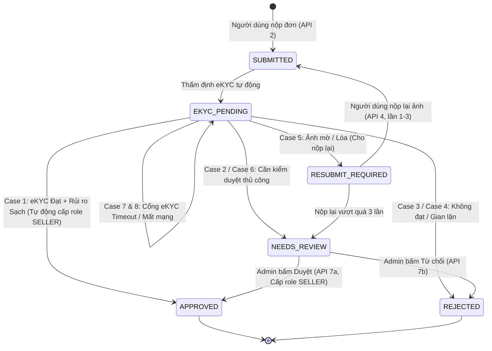

# TÀI LIỆU QUY TRÌNH XÁC THỰC NGƯỜI BÁN (SELLER EKYC VERIFICATION)

Tài liệu này mô tả chi tiết toàn bộ vòng đời, luồng gọi API theo thứ tự, trạng thái xử lý và ma trận 8 trường hợp (Case 1 - 8) của hệ thống xác thực người bán (eKYC) trong dự án **SecondLife**.

---

## 1. Tổng quan Kiến trúc & Vòng đời trạng thái

Mục đích: Nâng cấp tài khoản từ vai trò **BUYER** (Người mua) lên **SELLER** (Người bán) thông qua xác minh danh tính điện tử (eKYC) và đánh giá rủi ro gian lận (Seller Risk Engine).

### Các trạng thái hồ sơ (`SellerVerificationStatus`)
- `SUBMITTED`: Hồ sơ mới được người dùng tạo và tiếp nhận.
- `EKYC_PENDING`: Đang kết nối và chờ kết quả thẩm định từ cổng eKYC (VNPT / Mock).
- `APPROVED`: Hồ sơ hợp lệ, đã phê duyệt và **hệ thống tự động cấp quyền `SELLER`**.
- `NEEDS_REVIEW`: Hồ sơ có rủi ro hoặc ranh giới, chuyển sang **Quản trị viên (Admin) duyệt thủ công**.
- `RESUBMIT_REQUIRED`: Giấy tờ bị mờ, chói lóa, yêu cầu người dùng nộp lại ảnh (tối đa 3 lần).
- `REJECTED`: Hồ sơ bị từ chối (giấy tờ giả, hết hạn, vi phạm rủi ro, hoặc Admin từ chối).



---

## 2. Thứ tự gọi API từ A đến Z (Step-by-Step API Sequence)

### GIAI ĐOẠN 1: Chuẩn bị tài khoản & Đăng nhập

#### API 1: Đăng nhập tài khoản Người dùng (Buyer)
- **Phương thức & Endpoint**: `POST /api/v1/auth/login`
- **Mục đích**: Lấy JWT `accessToken` của tài khoản cần nâng cấp lên Người bán.
- **Request Body**:
```json
{
  "email": "buyer@example.com",
  "password": "Password@123"
}
```
- **Response**: Lấy `data.accessToken` gắn vào header:
  `Authorization: Bearer <accessToken_của_buyer>`

---

### GIAI ĐOẠN 2: Người dùng nộp hồ sơ xác thực

#### API 2: Nộp hồ sơ eKYC
- **Phương thức & Endpoint**: `POST /api/v1/seller-verifications`
- **Quyền yêu cầu**: `SELLER_VERIFICATION_SUBMIT` (tài khoản `BUYER` mặc định đã có).
- **Điều kiện ràng buộc**:
  1. Tài khoản chưa có vai trò `SELLER`.
  2. Không có yêu cầu nào đang hoạt động ở các trạng thái: `SUBMITTED`, `EKYC_PENDING`, `RESUBMIT_REQUIRED`, `NEEDS_REVIEW`.
- **Request Body**:
```json
{
  "verificationType": "CITIZEN_ID",
  "documentNumber": "037094012351",
  "documentFrontUrl": "https://storage.googleapis.com/.../cccd_mat_truoc.jpg",
  "documentBackUrl": "https://storage.googleapis.com/.../cccd_mat_sau.jpg",
  "selfieUrl": "https://storage.googleapis.com/.../anh_chuan_dung_selfie.jpg"
}
```
- **Xử lý bên dưới**:
  1. Lưu hồ sơ với trạng thái ban đầu `SUBMITTED`, mã hóa hash số CCCD để bảo mật.
  2. Đẩy qua `executeDecisionPipeline` (gọi eKYC Provider và SellerRiskService).
  3. Trả về kết quả ngay lập tức (`201 Created`).

---

### GIAI ĐOẠN 3: Người dùng theo dõi tiến độ hồ sơ

#### API 3: Tra cứu trạng thái hồ sơ của chính mình
- **Phương thức & Endpoint**: `GET /api/v1/seller-verifications/me`
- **Quyền yêu cầu**: `SELLER_VERIFICATION_READ_SELF`
- **Response**:
```json
{
  "success": true,
  "data": {
    "id": "7fa85f64-5717-4562-b3fc-2c963f66afa6",
    "status": "APPROVED",
    "ekycStatus": "PASSED",
    "riskStatus": "CLEAR",
    "reviewSource": "SYSTEM",
    "documentNumberMasked": "037******351",
    "faceMatchScore": 0.98,
    "livenessScore": 0.99,
    "documentScore": 0.95,
    "rejectionReason": null
  }
}
```

---

### GIAI ĐOẠN 4: Người dùng nộp lại ảnh (Nếu trạng thái là `RESUBMIT_REQUIRED`)

#### API 4: Nộp lại chứng từ rõ nét hơn
- **Phương thức & Endpoint**: `POST /api/v1/seller-verifications/{verificationId}/resubmit`
- **Quyền yêu cầu**: `SELLER_VERIFICATION_SUBMIT`
- **Điều kiện**: Hồ sơ phải đang ở trạng thái `RESUBMIT_REQUIRED`.
- **Giới hạn**: Tối đa 3 lần (`app.ekyc.max-resubmissions = 3`). Nếu nộp lại lần thứ 4, hệ thống tự động đưa hồ sơ về `NEEDS_REVIEW`.
- **Request Body**:
```json
{
  "documentFrontUrl": "https://storage.googleapis.com/.../cccd_mat_truoc_chup_lai.jpg",
  "documentBackUrl": "https://storage.googleapis.com/.../cccd_mat_sau_chup_lai.jpg",
  "selfieUrl": "https://storage.googleapis.com/.../selfie_moi.jpg"
}
```

---

### GIAI ĐOẠN 5: Quản trị viên xử lý hồ sơ (Nếu trạng thái là `NEEDS_REVIEW`)

#### API 5: Quản trị viên đăng nhập
- **Phương thức & Endpoint**: `POST /api/v1/auth/login`
- **Tài khoản Admin mặc định**:
  - `email`: `admin@secondlife.com`
  - `password`: `AdminPass@123456`
- **Response**: Lấy token của Admin gắn vào header:
  `Authorization: Bearer <accessToken_của_admin>`

#### API 6: Admin lọc danh sách hồ sơ cần thẩm định
- **Phương thức & Endpoint**: `GET /api/v1/admin/seller-verifications?status=NEEDS_REVIEW&page=0&size=20`
- **Quyền yêu cầu**: `SELLER_VERIFICATION_READ_ANY`
- **Chức năng**: Xem danh sách toàn bộ hồ sơ đang chờ duyệt, thông tin người nộp, điểm rủi ro, và lý do nghi vấn.

#### API 7: Admin xem chi tiết hồ sơ & lịch sử sự kiện
- **Phương thức & Endpoint**: `GET /api/v1/admin/seller-verifications/{id}`
- **Response**: Trả về link ảnh, số điểm Face match / Liveness / OCR chi tiết và **danh sách tất cả sự kiện chuyển trạng thái (Event History Timeline)** từ lúc khởi tạo.

#### API 8a: Admin Phê duyệt hồ sơ
- **Phương thức & Endpoint**: `POST /api/v1/admin/seller-verifications/{id}/approve`
- **Quyền yêu cầu**: `SELLER_VERIFICATION_REVIEW`
- **Hành động hệ thống**:
  1. Chuyển trạng thái sang `APPROVED` (ReviewSource: `ADMIN`).
  2. **Tự động gắn quyền `SELLER` vào bảng `user_roles` cho người dùng**.
  3. Gửi thông báo phê duyệt tới người dùng.

#### API 8b: Admin Từ chối hồ sơ
- **Phương thức & Endpoint**: `POST /api/v1/admin/seller-verifications/{id}/reject`
- **Quyền yêu cầu**: `SELLER_VERIFICATION_REVIEW`
- **Request Body**:
```json
{
  "rejectionReason": "Hình ảnh giấy tờ bị lóa góc số CCCD, vui lòng tạo hồ sơ mới với ảnh rõ ràng hơn"
}
```
- **Hành động hệ thống**: Chuyển trạng thái sang `REJECTED`, ghi lại lý do và thông báo cho người dùng.

---

## 3. Ma trận quyết định 8 trường hợp (Decision Matrix: Cases 1 - 8)

Hệ thống thẩm định trong `SellerVerificationServiceImpl.java` xử lý tự động theo bảng sau:

| Case | Kết quả eKYC (`ekycStatus`) | Đánh giá rủi ro (`riskStatus`) | Trạng thái cuối (`status`) | Nguồn duyệt (`reviewSource`) | Tự động cấp role SELLER? | Hành động tiếp theo |
| :---: | :--- | :--- | :--- | :--- | :---: | :--- |
| **Case 1** | **PASSED** (Điểm cao > 0.85) | **CLEAR** (Không trùng lặp, uy tín) | **`APPROVED`** | `SYSTEM` | **CÓ (Tự động)** | Người dùng bắt đầu đăng bán hàng được ngay |
| **Case 2** | **PASSED** | **REVIEW** (Nghi vấn khuôn mặt/IP) | **`NEEDS_REVIEW`** | `SYSTEM` | **KHÔNG** | Chờ Quản trị viên duyệt bằng API 8a hoặc 8b |
| **Case 3** | **PASSED** | **BLOCK** (Tài khoản gian lận/blacklist) | **`REJECTED`** | `SYSTEM` | **KHÔNG** | Từ chối vĩnh viễn, gửi thông báo lý do chặn |
| **Case 4** | **FAILED** (CCCD hết hạn, giả mạo) | Không đánh giá | **`REJECTED`** | `SYSTEM` | **KHÔNG** | Từ chối ngay, không cần Admin xem xét |
| **Case 5** | **UNCERTAIN** (Ảnh mờ, lóa, thiếu góc) | Không đánh giá | **`RESUBMIT_REQUIRED`** | `SYSTEM` | **KHÔNG** | Cho phép người dùng gọi API 4 nộp lại ảnh (tối đa 3 lần) |
| **Case 6** | **UNCERTAIN** (Không thể tự sửa hoặc > 3 lần) | Không đánh giá | **`NEEDS_REVIEW`** | `SYSTEM` | **KHÔNG** | Vượt quá 3 lần nộp lại, đẩy lên cho Admin duyệt tay |
| **Case 7** | **PROVIDER_ERROR** (Timeout > 5000ms) | Không đánh giá | **`EKYC_PENDING`** | `SYSTEM` | **KHÔNG** | Giữ trạng thái để hệ thống background retry sau |
| **Case 8** | **PROVIDER_ERROR** (Mạng sập 503) | Không đánh giá | **`EKYC_PENDING`** | `SYSTEM` | **KHÔNG** | Không từ chối hồ sơ của khách, đợi cổng eKYC phục hồi |

---

## 4. Bảng mã kiểm thử nhanh khi sử dụng MOCK Provider

Khi cấu hình `.env` sử dụng `VNPT_EKYC_PROVIDER=MOCK`, bạn có thể nhập các giá trị `documentNumber` sau để giả lập lập tức các tình huống:

| Giá trị `documentNumber` | Giả lập tình huống | Kết quả kỳ vọng |
| :--- | :--- | :--- |
| `012345678901` | Hồ sơ CCCD hợp lệ, ảnh chuẩn | **Case 1: `APPROVED`** (Tự động cấp role `SELLER`) |
| `012345678901_FAIL_EXPIRED` hoặc đuôi `9901` | CCCD đã hết hạn sử dụng | **Case 4: `REJECTED`** |
| `012345678901_FAIL_FAKE` hoặc đuôi `9902` | Nghi vấn cắt ghép / phôi giả | **Case 4: `REJECTED`** |
| `012345678901_FAIL_FACE` hoặc đuôi `9903` | Khuôn mặt selfie không khớp CCCD | **Case 4: `REJECTED`** |
| `012345678901_UNCERTAIN_BLURRY` hoặc đuôi `8801` | Ảnh quá mờ | **Case 5: `RESUBMIT_REQUIRED`** |
| `012345678901_UNCERTAIN_GLARE` hoặc đuôi `8802` | Ảnh bị chói lóa ánh đèn | **Case 5: `RESUBMIT_REQUIRED`** |
| `012345678901_UNCERTAIN_BORDERLINE` hoặc đuôi `8803` | Độ trùng khớp khuôn mặt ở mức ranh giới | **Case 6: `NEEDS_REVIEW`** |
| `012345678901_ERR_TIMEOUT` hoặc đuôi `7701` | Quá thời gian phản hồi | **Case 7: `EKYC_PENDING`** |

---

## 5. Lệnh chạy Automated Test

Toàn bộ các API và ma trận quyết định trên đã được kiểm thử tự động trong mã nguồn:
```powershell
# Chạy toàn bộ các test của Seller Verification
.\mvnw.cmd test -Dtest=*SellerVerification*

# Chạy riêng tầng Controller
.\mvnw.cmd test -Dtest=SellerVerificationControllerTest,AdminSellerVerificationControllerTest

# Chạy riêng tầng Business Service & 8 Cases
.\mvnw.cmd test -Dtest=SellerVerificationServiceTest
```
