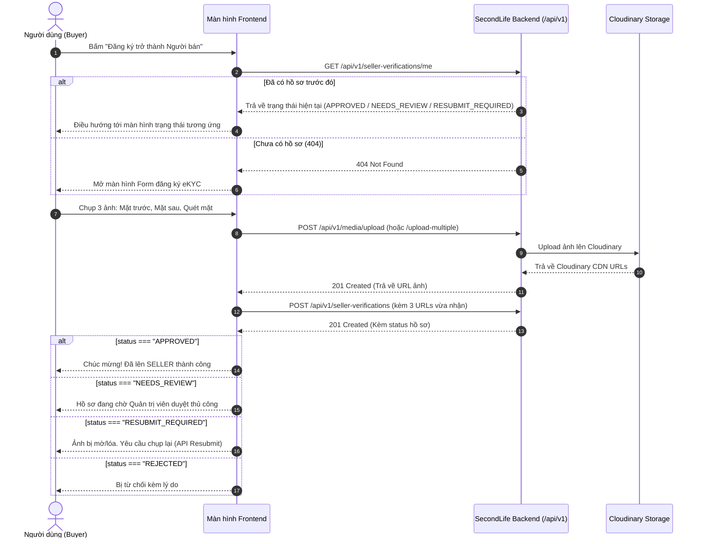

# TÀI LIỆU TÍCH HỢP EKYC DÀNH CHO FRONTEND (FE INTEGRATION GUIDE)

> **Dành cho:** Đội ngũ phát triển Frontend (Web / Mobile App)  
> **Chức năng:** Quy trình xác thực danh tính Người bán (Seller Identity eKYC Verification)  
> **Backend Base URL:** `http://localhost:8080/api/v1` (môi trường dev) hoặc cấu hình theo domain máy chủ.

---

## 1. Kiến trúc tổng quan luồng Frontend

Phía Frontend sẽ chịu trách nhiệm:
1. Mở camera, hiển thị khung định vị chụp CCCD (mặt trước, mặt sau) và quét khuôn mặt (selfie).
2. Upload 3 file ảnh lên dịch vụ Cloud Storage (Firebase, Cloudinary, AWS S3,...) để lấy **3 đường link URL công khai**.
3. Gọi API Backend để thẩm định hồ sơ và điều hướng màn hình tương ứng với kết quả trả về.



---

## 2. Các chuẩn dữ liệu TypeScript (Data Types)

Đội FE có thể copy trực tiếp các Interface sau vào dự án:

```typescript
export interface MediaUploadResponse {
  url: string;              // Link CDN Cloudinary (dùng để gửi vào API verification)
  publicId: string;         // ID file trên Cloudinary
  format: string;           // "jpg", "png", "webp"
  bytes: number;            // Kích thước file (bytes)
  originalFilename: string; // Tên file gốc
}

export type VerificationType = 'CITIZEN_ID' | 'PASSPORT';

export type SellerVerificationStatus =
  | 'SUBMITTED'           // Vừa nộp
  | 'EKYC_PENDING'        // Đang xử lý eKYC
  | 'APPROVED'            // Đã duyệt (Đã lên SELLER)
  | 'NEEDS_REVIEW'        // Chờ Admin duyệt tay
  | 'RESUBMIT_REQUIRED'   // Yêu cầu nộp lại ảnh rõ hơn
  | 'REJECTED';           // Bị từ chối

export type EkycStatus = 'NOT_STARTED' | 'PENDING' | 'PASSED' | 'FAILED' | 'UNCERTAIN' | 'PROVIDER_ERROR';

export interface SellerVerificationResponse {
  id: string;
  userId: string;
  verificationType: VerificationType;
  documentNumberMasked: string; // Ví dụ: "037******351"
  documentFrontUrl: string;
  documentBackUrl: string;
  selfieUrl: string | null;
  status: SellerVerificationStatus;
  ekycStatus: EkycStatus;
  riskStatus: 'CLEAR' | 'REVIEW' | 'BLOCK' | 'NOT_EVALUATED';
  reviewSource: 'SYSTEM' | 'ADMIN' | null;
  reasonCode: string | null;
  rejectionReason: string | null;
  resubmissionCount: number; // Tối đa 3 lần
  faceMatchScore: number | null;
  livenessScore: number | null;
  documentScore: number | null;
  submittedAt: string;
  reviewedAt: string | null;
}

export interface ApiResponse<T> {
  success: boolean;
  message: string;
  data: T;
  timestamp: string;
}
```

---

## 3. Thứ tự gọi API & Xử lý màn hình ở Frontend

> ⚠️ **Lưu ý bảo mật**: Mọi request (trừ login) bắt buộc phải đính kèm Header:  
> `Authorization: Bearer <accessToken_của_user>`

---

### BƯỚC 1: Kiểm tra hồ sơ khi vào màn hình ("Check on Mount")
Khi người dùng bấm vào mục "Kênh người bán" hoặc "Đăng ký người bán", FE luôn gọi API này trước để xác định màn hình cần hiển thị:

- **Endpoint**: `GET /api/v1/seller-verifications/me`
- **Xử lý các tình huống Response**:
  1. **HTTP 404 (Chưa có hồ sơ)**: 
     ➔ Hiển thị màn hình Form hướng dẫn chuẩn bị chụp CCCD và nút "Bắt đầu xác thực".
  2. **HTTP 200 & `status === "APPROVED"`**: 
     ➔ Người dùng đã là SELLER. Chuyển thẳng vào Dashboard bán hàng / Đăng sản phẩm.
  3. **HTTP 200 & `status === "NEEDS_REVIEW"` hoặc `"EKYC_PENDING"`**: 
     ➔ Hiển thị màn hình chờ: *"Hồ sơ của bạn đang được chuyên viên xét duyệt trong vòng 24h"*.
  4. **HTTP 200 & `status === "RESUBMIT_REQUIRED"`**: 
     ➔ Hiển thị thông báo: *"Ảnh chụp chưa đạt: {rejectionReason}"* và nút **"Chụp lại ảnh"** (Chuyển sang Bước 4).
  5. **HTTP 200 & `status === "REJECTED"`**: 
     ➔ Hiển thị thông báo từ chối kèm lý do và nút **"Tạo hồ sơ mới"**.

---

### BƯỚC 2: Chụp ảnh & Upload trực tiếp lên Backend qua Cloudinary

Sau khi chụp 3 ảnh: Mặt trước, Mặt sau và Selfie, **FE không cần cấu hình Cloudinary**, chỉ cần gửi file lên Backend qua 1 trong 2 API sau:

#### Cách A: Upload từng file lẻ (`POST /api/v1/media/upload`)
- **Endpoint**: `POST /api/v1/media/upload`
- **Content-Type**: `multipart/form-data`
- **Body**: `file` (File binary ảnh), `folder` (tùy chọn, mặc định: `"secondlife/verifications"`)
- **Code mẫu Axios**:
```typescript
async function uploadSingleImage(file: File): Promise<string> {
  const formData = new FormData();
  formData.append('file', file);
  formData.append('folder', 'secondlife/verifications');

  const res = await axios.post('/api/v1/media/upload', formData, {
    headers: {
      'Content-Type': 'multipart/form-data',
      Authorization: `Bearer ${accessToken}`,
    },
  });

  // Trả về URL ảnh: https://res.cloudinary.com/dmcodhbcc/image/upload/...
  return res.data.data.url;
}
```

#### Cách B (Khuyên dùng - Nhanh nhất): Upload cả 3 file cùng 1 lượt (`POST /api/v1/media/upload-multiple`)
- **Endpoint**: `POST /api/v1/media/upload-multiple`
- **Content-Type**: `multipart/form-data`
- **Body**: `files` (Mảng chứa 3 file: frontFile, backFile, selfieFile)
- **Code mẫu Axios**:
```typescript
async function uploadAllVerificationImages(frontFile: File, backFile: File, selfieFile: File) {
  const formData = new FormData();
  formData.append('files', frontFile);
  formData.append('files', backFile);
  formData.append('files', selfieFile);
  formData.append('folder', 'secondlife/verifications');

  const res = await axios.post('/api/v1/media/upload-multiple', formData, {
    headers: {
      'Content-Type': 'multipart/form-data',
      Authorization: `Bearer ${accessToken}`,
    },
  });

  // res.data.data là mảng 3 phần tử theo thứ tự: [front, back, selfie]
  const [frontRes, backRes, selfieRes] = res.data.data;
  return {
    documentFrontUrl: frontRes.url,
    documentBackUrl: backRes.url,
    selfieUrl: selfieRes.url,
  };
}
```


---

### BƯỚC 3: Nộp hồ sơ xác thực mới
Sau khi có 3 URLs, FE gửi payload lên Backend:

- **Endpoint**: `POST /api/v1/seller-verifications`
- **Method**: `POST`
- **Request Headers**:
  ```http
  Authorization: Bearer <accessToken>
  Content-Type: application/json
  ```
- **Request Body**:
```json
{
  "verificationType": "CITIZEN_ID",
  "documentNumber": "037094012351",
  "documentFrontUrl": "https://storage.googleapis.com/.../cccd_front.jpg",
  "documentBackUrl": "https://storage.googleapis.com/.../cccd_back.jpg",
  "selfieUrl": "https://storage.googleapis.com/.../selfie.jpg"
}
```

- **Xử lý Response (`201 Created`)**:
```javascript
const res = await api.post('/api/v1/seller-verifications', payload);
const { status, rejectionReason } = res.data.data;

if (status === 'APPROVED') {
  // Case 1: Đạt ngay -> Chúc mừng và cấp quyền Seller
  toast.success('Xác thực thành công! Bạn đã trở thành Người bán.');
  navigate('/seller/dashboard');
} else if (status === 'NEEDS_REVIEW') {
  // Case 2 hoặc Case 6: Cần xem xét thủ công
  navigate('/seller/verification-pending');
} else if (status === 'RESUBMIT_REQUIRED') {
  // Case 5: Ảnh mờ hoặc lóa
  toast.warning(`Ảnh chưa đạt: ${rejectionReason}`);
  navigate('/seller/resubmit', { state: { verificationId: res.data.data.id } });
} else if (status === 'REJECTED') {
  // Case 3 hoặc Case 4: Từ chối
  toast.error(`Hồ sơ bị từ chối: ${rejectionReason}`);
  navigate('/seller/rejected');
}
```

---

### BƯỚC 4: Nộp lại chứng từ (Dành riêng cho trạng thái `RESUBMIT_REQUIRED`)
Nếu Backend trả về `RESUBMIT_REQUIRED`, FE chuyển người dùng sang màn hình chụp lại ảnh và gọi API:

- **Endpoint**: `POST /api/v1/seller-verifications/{verificationId}/resubmit`
- **Method**: `POST`
- **Request Body**:
```json
{
  "documentFrontUrl": "https://storage.googleapis.com/.../cccd_front_new.jpg",
  "documentBackUrl": "https://storage.googleapis.com/.../cccd_back_new.jpg",
  "selfieUrl": "https://storage.googleapis.com/.../selfie_new.jpg"
}
```
*(Hệ thống cho phép nộp lại tối đa 3 lần. Vượt quá 3 lần sẽ tự động chuyển sang `NEEDS_REVIEW` để Admin xem xét).*

---

## 4. Bảng ánh xạ trạng thái sang giao diện (UI Status Mapping)

| Trạng thái (`status`) | Màu sắc (Badge) | Tiêu đề hiển thị | Mô tả cho người dùng | Hành động nút bấm |
| :--- | :---: | :--- | :--- | :--- |
| **`APPROVED`** | 🟢 Xanh lục | Đã xác thực thành công | Chúc mừng! Tài khoản của bạn đã được nâng cấp lên Người bán. | Nút "Vào kênh Người bán" |
| **`NEEDS_REVIEW`** | 🟡 Vàng cam | Đang chờ xét duyệt | Hồ sơ của bạn đang được chuyên viên thẩm định thủ công. | Nút "Kiểm tra lại trạng thái" |
| **`RESUBMIT_REQUIRED`** | 🟠 Cam đậm | Cần bổ sung/Chụp lại ảnh | Ảnh CCCD hoặc khuôn mặt bị mờ/chói sáng: *{rejectionReason}* | Nút **"Chụp lại ảnh ngay"** |
| **`REJECTED`** | 🔴 Đỏ | Hồ sơ không được duyệt | Lý do: *{rejectionReason}*. | Nút "Tạo hồ sơ mới" / "Liên hệ hỗ trợ" |
| **`EKYC_PENDING`** | 🔵 Xanh dương | Đang đối soát thông tin | Hệ thống đang kết nối đối soát dữ liệu eKYC... | Loading Spinner |

---

## 5. Dữ liệu Test giả lập (Mock Data) cho Frontend

Khi Backend đang cấu hình `VNPT_EKYC_PROVIDER=MOCK`, FE có thể nhập các giá trị `documentNumber` sau vào ô nhập liệu để kiểm tra giao diện từng trường hợp mà không cần ảnh thật:

| Nhập số CCCD (`documentNumber`) | Tình huống giả lập | Trạng thái FE nhận được |
| :--- | :--- | :--- |
| `037094012351` | Thẩm định thành công hoàn toàn | **`APPROVED`** (Tự động chuyển vào Dashboard người bán) |
| `037094012351_UNCERTAIN_BLURRY` | Giả lập ảnh bị mờ | **`RESUBMIT_REQUIRED`** (Test luồng chụp lại ảnh) |
| `037094012351_UNCERTAIN_GLARE` | Giả lập ảnh bị lóa đèn | **`RESUBMIT_REQUIRED`** (Test luồng chụp lại ảnh) |
| `037094012351_UNCERTAIN_BORDERLINE` | Giả lập điểm ranh giới nghi vấn | **`NEEDS_REVIEW`** (Test màn hình chờ xét duyệt) |
| `037094012351_FAIL_EXPIRED` | Giả lập CCCD hết hạn sử dụng | **`REJECTED`** (Test màn hình từ chối) |
| `037094012351_FAIL_FACE` | Giả lập khuôn mặt không khớp | **`REJECTED`** (Test màn hình từ chối) |

---

## 6. Các mã lỗi HTTP thường gặp & Cách FE xử lý

| Mã lỗi | Nguyên nhân | Cách FE hiển thị |
| :---: | :--- | :--- |
| **`400 Bad Request`** | Thiếu URL ảnh, link URL quá dài hoặc sai định dạng số CCCD. | Hiển thị thông báo lỗi validate dưới từng ô input. |
| **`401 Unauthorized`** | Token JWT hết hạn hoặc chưa đăng nhập. | Đưa người dùng về màn hình Login hoặc gọi API Refresh Token. |
| **`403 Forbidden`** | Người dùng thiếu quyền `SELLER_VERIFICATION_SUBMIT`. | Báo lỗi tài khoản chưa đủ điều kiện. |
| **`409 Conflict`** | Người dùng **đã là SELLER rồi** hoặc **đã có hồ sơ đang chờ duyệt**. | Thông báo: *"Bạn đã có yêu cầu đang được xử lý, không thể nộp thêm yêu cầu mới"*. |
