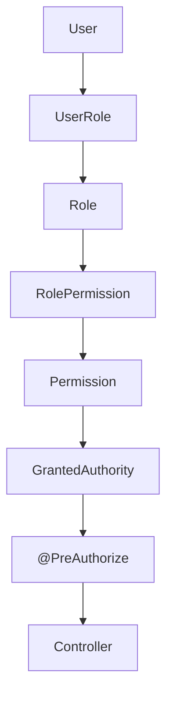

# Báo cáo hoàn thiện RBAC

## 1. Files created

- `src/main/java/com/secondlife/secondlife/dto/rbac/ReplaceUserRolesRequest.java`
- `src/main/java/com/secondlife/secondlife/dto/rbac/UserRolesResponse.java`
- `src/main/java/com/secondlife/secondlife/dto/rbac/UserRoleAuditResponse.java`
- `src/main/java/com/secondlife/secondlife/entity/UserRoleAudit.java`
- `src/main/java/com/secondlife/secondlife/repository/UserRoleAuditRepository.java`
- `src/main/java/com/secondlife/secondlife/service/AdminUserRoleService.java`
- `src/main/java/com/secondlife/secondlife/service/impl/AdminUserRoleServiceImpl.java`
- `src/main/resources/db/migration/V18__complete_api_rbac_and_user_role_audit.sql`
- `src/test/java/com/secondlife/secondlife/integration/AdminUserRolesIntegrationTest.java`
- `src/test/java/com/secondlife/secondlife/service/AdminUserRoleServiceTest.java`
- `src/test/java/com/secondlife/secondlife/integration/RbacV18MigrationTest.java`
- Tài liệu này.

## 2. Files modified

Đường dẫn Java bên dưới tương đối với `src/main/java/com/secondlife/secondlife/`:

| File | Thay đổi |
| --- | --- |
| `config/PermissionMethodSecurityConfig.java` | Luôn bật method security, bỏ khả năng bypass bằng cấu hình |
| `config/SecurityConfig.java` | Guard ADMIN + ADMIN_RBAC_MANAGE cho endpoint role user ở filter |
| `controller/admin/AdminUserController.java` | GET/PUT role user, GET audit |
| `controller/admin/AdminPostController.java` | POST_REVIEW cho API đọc bài chờ duyệt |
| `controller/InspectionController.java` | Guard riêng cho đọc own/all, assign, submit report |
| `controller/InspectionCenterController.java` | INSPECTION_STAFF_MANAGE cho quản lý inspector |
| `controller/AiChatController.java` | AI_CHAT_SELF |
| `controller/MediaController.java` | MEDIA_UPLOAD_SELF |
| `controller/TopupController.java` | CREDIT_READ_SELF / CREDIT_PURCHASE_SELF |
| `controller/PostController.java` | Khớp DTO/chữ ký finalize và submit với service, validate submit body |
| `entity/User.java` | Không serialize passwordHash |
| `enums/PermissionCode.java` | Sáu quyền mới và danh sách mã có nghiệp vụ đã triển khai |
| `security/jwt/JwtAuthenticationFilter.java` | Chỉ xác thực tài khoản ACTIVE, clear context khi lỗi |
| `seeder/RbacDataSeeder.java` | Metadata/default mapping cho sáu quyền mới; giữ nguyên revocation khi restart |
| `service/impl/AdminRbacServiceImpl.java` | Không tạo mã permission tùy ý; policy cố định cho mã hệ thống |
| `service/impl/AiChatServiceImpl.java` | Ownership session và post trước khi đọc history/ghi/call AI |
| `service/impl/PostServiceImpl.java` | Ownership session và post trước finalize/submit; trả 403/404 |
| `service/impl/InspectionServiceImpl.java` | Ownership report, target active INSPECTOR, trả DTO nhân viên |
| `service/impl/SellerVerificationServiceImpl.java` | Hồ sơ của người khác trả 403 khi resubmit |
| `service/impl/RoleAssignmentServiceImpl.java` | Khóa ADMIN trước user khi sửa membership ADMIN |
| `service/impl/UserServiceImpl.java` | Cùng khóa ADMIN bảo vệ admin cuối; kiểm tra trạng thái đầu vào |
| `service/impl/AuthServiceImpl.java` | Google login từ chối tài khoản chưa ACTIVE |
| `service/impl/TokenServiceImpl.java` | Refresh từ chối tài khoản chưa ACTIVE |

Ngoài ra sửa `.env.example`, `src/main/resources/application.properties`, `docs/ADMIN_PERMISSION_API_GUIDE.md`; cập nhật test `AdminRbacIntegrationTest`, `Day04SellerVerificationIntegrationTest`, `FlywayMigrationTest`, `PermissionCatalogMigrationTest`, `PermissionBypassTest`, `AdminRbacServiceTest`, `TokenServiceTest`, `UserServiceTest`.

`PostService.java` có thay đổi định dạng xuất hiện trong workspace trong lúc thực hiện; giữ nguyên thay đổi đó, không đổi hợp đồng nghiệp vụ trong interface.

## 3. Database changes

V18 tạo `user_role_audit`: UUID PK; FK `user_id`, `changed_by` tới `users`, `role_code` tới `roles.code`; CHECK `action IN ('GRANT','REVOKE')`; index `(user_id, changed_at DESC)`.

V18 seed sáu permission có API thật và mapping mặc định bằng `ON CONFLICT DO NOTHING`. Không xóa permission/role/mapping hiện có. V1–V17 giữ nguyên checksum. Schema many-to-many hiện có đã có PK ghép và FK cho `user_roles`/`role_permissions`, UNIQUE cho `roles.code`/`permissions.code`; không tạo lại các bảng này.

Ngày 02/10/2026 phát hiện database hiện có không có default cho `permissions.id`. V18 đã rollback vì seed không truyền id (SQLSTATE 23502). V18 chưa áp dụng trên database đó được sửa để truyền `gen_random_uuid()` trực tiếp, không phụ thuộc default; test PostgreSQL 18.4 tái hiện lỗi trước bản sửa và kiểm tra giữ nguyên permission/mapping cũ sau nâng cấp. Không dùng Flyway repair hoặc sửa V1–V17.

Migration được kiểm thử trên PostgreSQL Testcontainers riêng. Kiểm tra read-only sau lỗi startup xác nhận database ứng dụng đã ở V17; V18 chưa áp dụng. Lần kiểm tra khởi động để áp dụng V18 bị automatic approval review từ chối vì chưa có chấp thuận thay đổi database thật. Seeder chỉ cấp default permission cho role vừa được tạo; restart không tự khôi phục các permission đã bị admin thu hồi.

## 4. Roles hiện có

`BUYER`, `SELLER`, `INSPECTOR`, `STAFF`, `INSPECTION_CENTER`, `ADMIN`. Giữ INSPECTION_CENTER để tương thích chức năng quản lý trung tâm đang có. User có thể mang nhiều role, không nhận role trực tiếp từ dữ liệu đăng ký.

## 5. Permissions hiện có

Catalog mặc định có 37 mã. Enum có thêm ba mã POST dự phòng chưa seed, tổng cộng 40 mã enum.

| Nhóm | Mã |
| --- | --- |
| Hồ sơ | PROFILE_READ_SELF, PROFILE_UPDATE_SELF, PASSWORD_CHANGE_SELF |
| Seller verification | SELLER_VERIFICATION_SUBMIT, SELLER_VERIFICATION_READ_SELF, SELLER_VERIFICATION_READ_ANY, SELLER_VERIFICATION_REVIEW |
| Bài đăng | LISTING_CREATE_SELF, LISTING_PUBLISH_SELF, POST_REVIEW |
| Credit | CREDIT_READ_SELF, CREDIT_PURCHASE_SELF |
| User | USER_READ_ANY, USER_STATUS_UPDATE |
| RBAC/giá | ADMIN_RBAC_MANAGE, ADMIN_PRICING_MANAGE |
| Trung tâm/kiểm định | INSPECTION_CENTER_ACCOUNT_MANAGE, INSPECTION_REPORT_SUBMIT, INSPECTION_ORDER_READ_SELF, INSPECTION_ORDER_READ_ANY, INSPECTION_ORDER_ASSIGN, INSPECTION_STAFF_MANAGE |
| Chat/media | AI_CHAT_SELF, MEDIA_UPLOAD_SELF |
| Giữ lại cho nghiệp vụ chưa triển khai | ROLE_READ, STAFF_LISTING_REVIEW, STAFF_FRAUD_REVIEW, STAFF_DISPUTE_REVIEW, STAFF_PAYOUT_REVIEW, STAFF_PAYOUT_HOLD, STAFF_USER_WARN, STAFF_USER_TEMP_RESTRICT, ADMIN_STAFF_MANAGE, ADMIN_COMMISSION_MANAGE, ADMIN_CONFIG_MANAGE, ADMIN_PERMANENT_BAN, ADMIN_HIGH_VALUE_PAYOUT |
| Enum dự phòng, chưa seed/chưa có endpoint | POST_CREATE, POST_UPDATE, POST_DELETE |

Các mã dự phòng không đồng nghĩa với API đã triển khai. Giữ catalog cũ để tránh breaking change, nhưng API tạo mới không khởi tạo mã chưa có nghiệp vụ. Custom permission cũ vẫn được quản lý/thu hồi; mã tùy ý mới bị từ chối 400. Permission hệ thống có thể sửa metadata, không xóa/đổi policy. Không có engine ánh xạ endpoint từ database.

## 6. Role-Permission mapping

Đây là **default mapping**, không thay cho dữ liệu runtime sau khi admin cấp/thu hồi:

| Role | Permission mặc định |
| --- | --- |
| BUYER | PROFILE_READ_SELF, PROFILE_UPDATE_SELF, PASSWORD_CHANGE_SELF, SELLER_VERIFICATION_SUBMIT, SELLER_VERIFICATION_READ_SELF, AI_CHAT_SELF, MEDIA_UPLOAD_SELF |
| SELLER | PROFILE_READ_SELF, PROFILE_UPDATE_SELF, PASSWORD_CHANGE_SELF, SELLER_VERIFICATION_READ_SELF, LISTING_CREATE_SELF, LISTING_PUBLISH_SELF, CREDIT_READ_SELF, CREDIT_PURCHASE_SELF, AI_CHAT_SELF, MEDIA_UPLOAD_SELF |
| INSPECTOR | PROFILE_READ_SELF, PROFILE_UPDATE_SELF, PASSWORD_CHANGE_SELF, INSPECTION_REPORT_SUBMIT, INSPECTION_ORDER_READ_SELF, AI_CHAT_SELF, MEDIA_UPLOAD_SELF |
| STAFF | PROFILE_READ_SELF, PROFILE_UPDATE_SELF, PASSWORD_CHANGE_SELF, USER_READ_ANY, SELLER_VERIFICATION_READ_ANY, ROLE_READ, bảy STAFF_* trong catalog, AI_CHAT_SELF, MEDIA_UPLOAD_SELF |
| INSPECTION_CENTER | PROFILE_READ_SELF, PROFILE_UPDATE_SELF, PASSWORD_CHANGE_SELF, INSPECTION_ORDER_READ_ANY, INSPECTION_ORDER_ASSIGN, INSPECTION_STAFF_MANAGE, AI_CHAT_SELF, MEDIA_UPLOAD_SELF |
| ADMIN | Toàn bộ 37 permission hệ thống được seed; role permission không sửa bằng API |

`GET /api/admin/roles` trả mapping thực tế và `editable`; `GET /api/admin/permissions` trả policy `assignableRoles`. Policy giới hạn theo nhiệm vụ: listing/credit chỉ SELLER, submit report chỉ INSPECTOR, quản lý kiểm định chỉ CENTER; ADMIN_RBAC_MANAGE và các quyền admin giữ riêng ADMIN. Profile/chat/media cho các role không phải ADMIN đều có thể được cấp/thu hồi. Thay permission của role không yêu cầu đổi token.

## 7. User-Role mechanism

PUT thay toàn bộ tập role, dùng `expectedRoleCodes` để phát hiện ghi đè dữ liệu đã đổi. Guard yêu cầu ADMIN và ADMIN_RBAC_MANAGE ở cả filter/controller. Enum và role thực trong DB được kiểm tra trước khi ghi.

Transaction khóa role ADMIN trước rồi user; mọi writer sửa membership ADMIN và trạng thái tài khoản dùng cùng thứ tự. Khóa chung bảo vệ kiểm tra số admin ACTIVE ngay cả khi hai request tác động hai admin khác nhau. Chặn tự gỡ ADMIN, gỡ admin hoạt động cuối cùng; thêm SELLER cần hồ sơ APPROVED. Ghi audit cho từng GRANT/REVOKE, tăng tokenVersion, thu hồi refresh token. No-op không tạo audit/thu hồi token. Service cấp SELLER nội bộ từ eKYC tiếp tục hoạt động.

## 8. JWT/authority mechanism

Giữ JWT HS256 và thư viện hiện có. Access token chứa `sub=userId`, email, loại ACCESS, tokenVersion, iat/exp; không chứa role/permission. Login response có roles/permissions phục vụ UI, không phải nguồn authorization.

`JwtAuthenticationFilter` xác minh token, tải user qua `CustomUserDetailsService.loadUserById`; `UserRepository.findByIdWithAuthorities` fetch UserRole → Role → RolePermission → Permission. `CustomUserDetails` hợp nhất, loại trùng authority `ROLE_<roleCode>` và permission code nguyên văn; filter tạo Authentication trong SecurityContext. `hasRole('ADMIN')` kiểm tra ROLE_ADMIN, còn `hasAuthority('ADMIN_RBAC_MANAGE')` kiểm tra authority độc lập.

Thay ROLE→PERMISSION: có hiệu lực từ request kế tiếp, kể cả JWT cũ còn hạn; request đang thực thi không bị đánh giá lại giữa chừng. Thay USER→ROLE: tokenVersion tăng, JWT cũ 401, refresh token bị revoke, đăng nhập lại để nhận token hợp lệ. LOCKED/DISABLED/PENDING_VERIFICATION bị từ chối ở filter; refresh và Google login chỉ chấp nhận ACTIVE. Method security luôn bật kể cả cờ cấu hình cũ false.

## 9. APIs RBAC

| Method | URL | Tác dụng |
| --- | --- | --- |
| GET | /api/admin/permissions | Catalog và policy |
| GET | /api/admin/permissions/{permissionCode} | Chi tiết |
| POST | /api/admin/permissions | Khởi tạo mã hệ thống đã triển khai nếu thiếu |
| PUT | /api/admin/permissions/{permissionCode} | Metadata; policy custom cũ |
| DELETE | /api/admin/permissions/{permissionCode} | Xóa custom chưa được gán |
| GET | /api/admin/roles | Mapping thực tế |
| GET | /api/admin/roles/{roleCode} | Role và tập permission |
| PUT | /api/admin/roles/{roleCode}/permissions | Replace permission, expectedPermissionCodes |
| GET | /api/admin/roles/{roleCode}/permission-changes | Audit phân trang |
| GET | /api/v1/admin/users/{userId}/roles | Role và effective permission user |
| PUT | /api/v1/admin/users/{userId}/roles | Replace role, expectedRoleCodes |
| GET | /api/v1/admin/users/{userId}/role-changes | Audit phân trang |

Tất cả yêu cầu ADMIN + ADMIN_RBAC_MANAGE. Giữ đường dẫn dựa theo convention hiện tại, dùng roleCode thay roleId. 400: validation/policy/mã sai; 401: chưa xác thực/token hết hiệu lực; 403: thiếu quyền/ownership; 404: đối tượng không có; 409: stale state, trùng mã, hạn chế hệ thống hoặc SELLER chưa đủ điều kiện. Chi tiết body tại [hướng dẫn admin](ADMIN_PERMISSION_API_GUIDE.md).

## 10. Các API được bảo vệ bằng permission

| Nhóm API | Guard |
| --- | --- |
| GET/PATCH /api/users/me | PROFILE_READ_SELF / PROFILE_UPDATE_SELF |
| POST /api/auth/change-password | PASSWORD_CHANGE_SELF |
| Submit/resubmit /api/seller-verifications; /api/v1/ekyc/verify | SELLER_VERIFICATION_SUBMIT; ownership resubmit |
| Read own seller verification | SELLER_VERIFICATION_READ_SELF |
| /api/staff/seller-verifications | STAFF + SELLER_VERIFICATION_READ_ANY |
| Admin read/review seller verification | ADMIN + SELLER_VERIFICATION_READ_ANY / SELLER_VERIFICATION_REVIEW |
| Provision inspection center | INSPECTION_CENTER_ACCOUNT_MANAGE |
| GET admin users/detail, PATCH status | USER_READ_ANY / USER_STATUS_UPDATE |
| /api/admin/credit-pricing và discount tiers | ADMIN + ADMIN_PRICING_MANAGE |
| /api/seller/credits, credit-pricing, purchases, ledger | SELLER + CREDIT_READ_SELF / CREDIT_PURCHASE_SELF |
| /api/v1/posts/init, finalize-chat | LISTING_CREATE_SELF; ownership session + post |
| /api/v1/posts/submit/{postId} | LISTING_PUBLISH_SELF; ownership post |
| GET /api/v1/admin/posts, approve/reject | POST_REVIEW |
| /api/v1/topup/packages, my-credit, purchase | CREDIT_READ_SELF / CREDIT_PURCHASE_SELF |
| POST /api/v1/ai/chat | AI_CHAT_SELF; ownership session + post |
| /api/v1/media/upload, upload-multiple | MEDIA_UPLOAD_SELF |
| GET /api/v1/inspector/orders | INSPECTION_ORDER_READ_SELF; user ID lấy từ principal |
| GET /api/v1/inspector/orders/all | INSPECTION_ORDER_READ_ANY |
| POST /api/v1/inspector/orders/{orderId}/assign | INSPECTION_ORDER_ASSIGN; target ACTIVE + INSPECTOR |
| POST /api/v1/inspector/orders/{orderId}/result | INSPECTION_REPORT_SUBMIT; phải là inspector được phân công |
| /api/v1/inspector-center/staff | INSPECTION_STAFF_MANAGE; trả DTO không có password hash |
| Catalog/role permission/user role admin | ADMIN + ADMIN_RBAC_MANAGE |

Category/item GET giữ policy authenticated hiện có. Auth công khai, health, Swagger và callback mock có xác thực chữ ký giữ policy hiện có. Không thêm endpoint CRUD cho nghiệp vụ chưa có API. Legacy topup purchase vẫn không cấp credit khi chưa có tích hợp thanh toán.

## 11. Test results

Lệnh: `mvn test`, Java 21, PostgreSQL 16 Testcontainers và PostgreSQL 18.4 cho regression migration. **BUILD SUCCESS: 224 tests, 0 failures, 0 errors, 0 skipped.** Lượt chạy đầy đủ sau bản sửa V18 hoàn tất ngày 02/10/2026; log tại `target/rbac-v18-fixed-tests.log` (build artifact, không commit). Test V18 đã được chạy trước bản sửa và thất bại đúng SQLSTATE 23502; sau bản sửa nâng cấp thành công, giữ dữ liệu cũ và không migrate lại lần hai.

| Yêu cầu | Kiểm thử |
| --- | --- |
| ADMIN có quyền được phép | AdminRbacIntegrationTest, AdminUserRolesIntegrationTest |
| STAFF thiếu permission → 403 | AdminRbacIntegrationTest: revoke quyền đọc seller verification rồi gọi API |
| Cấp STAFF permission → allowed | Cùng JWT gọi lại API sau grant |
| Thu hồi → 403 | Permission tồn tại trong catalog nhưng không còn ở role, JWT cũ bị từ chối quyền |
| User thường sửa role permission → 403 | AdminUserRolesIntegrationTest kiểm tra BUYER/STAFF |
| Anonymous → 401 | Test API RBAC và user role |
| Permission chưa gán không tạo authority | Revoke test và RbacAuthorizationTest |
| Role khác nhau / nhiều role resolve đúng | INSPECTOR/CENTER, BUYER + STAFF; kiểm tra union trong /api/users/me |
| Có permission nhưng sai owner → 403 | Chat session, post giả mạo, submit bài, inspection report, resubmit hồ sơ |
| Không bypass bằng cờ false | PermissionBypassTest |
| Role replacement concurrency → 200/409 | AdminUserRolesIntegrationTest |
| Bảo vệ ADMIN cuối và thứ tự khóa | AdminUserRoleServiceTest, UserServiceTest, Day03AccountSellerIntegrationTest |
| Migration/checksum/API docs | PermissionCatalogMigrationTest, FlywayMigrationTest |

Các test ownership dùng repository domain mock để dựng dữ liệu tấn công; authentication, role/permission và lifecycle trong integration test dùng JWT thật và database thật. Test này không xác nhận persistence happy path của AI/inspection toàn bộ.

## 12. Những vấn đề còn lại

- Chưa có quan hệ center→inspector/inspection order trong domain, nên manager có quyền quản lý kiểm định toàn hệ thống; chưa cách ly theo từng trung tâm. Cần quan hệ nghiệp vụ/migration riêng để thực hiện isolation đúng.
- 13 permission catalog cũ chưa có endpoint thực tế và ba enum POST chưa triển khai; không coi đó là CRUD đã tồn tại. Chức năng payout/fraud/commission/config cần task nghiệp vụ riêng.
- Google verifier hiện cho phép bỏ kiểm tra audience khi thiếu client ID, và liên kết tài khoản theo email chưa bắt buộc emailVerified từ provider. Đây là vấn đề auth hiện có, cần task hardening riêng; bản RBAC này không viết lại Google authentication.
- Một số API bài đăng còn trả entity; passwordHash đã bị chặn serialize, nhưng nên chuyển toàn bộ sang response DTO để kiểm soát dữ liệu và quan hệ vòng.
- Database ứng dụng đang ở V17. Áp dụng V18 và xác minh startup trên DB thật còn chờ chấp thuận; không sửa checksum bằng Flyway repair.

## Sơ đồ và trace request



Ví dụ request đã được kiểm thử:

```http
GET /api/staff/seller-verifications HTTP/1.1
Authorization: Bearer <accessToken của STAFF>
```

JWT → kiểm tra chữ ký/exp/type/tokenVersion → truy vấn user và mapping database → Authentication có ROLE_STAFF cùng các permission đang gán → SecurityContext → `@PreAuthorize("hasRole('STAFF') and hasAuthority('SELLER_VERIFICATION_READ_ANY')")` → 200 nếu có cả hai; 403 nếu thiếu permission.

Admin PUT `/api/admin/roles/STAFF/permissions` bỏ SELLER_VERIFICATION_READ_ANY, commit transaction và audit → gửi lại chính request trên với **cùng JWT** → filter tải authority mới → 403. Grant lại → cùng JWT → 200. Không có Bearer/token không hợp lệ → 401 trước controller. Đây là thay đổi ROLE→PERMISSION; nếu thay USER→ROLE thì JWT cũ trả 401 do tokenVersion.
